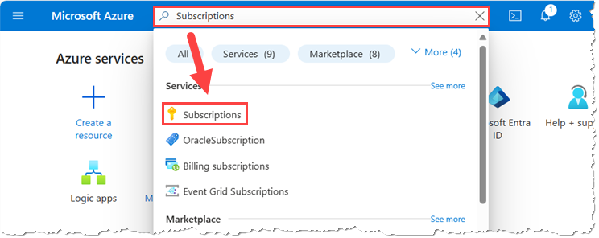
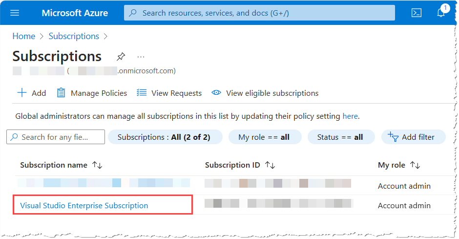
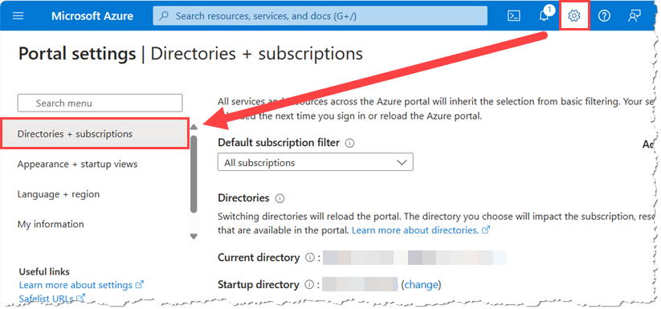
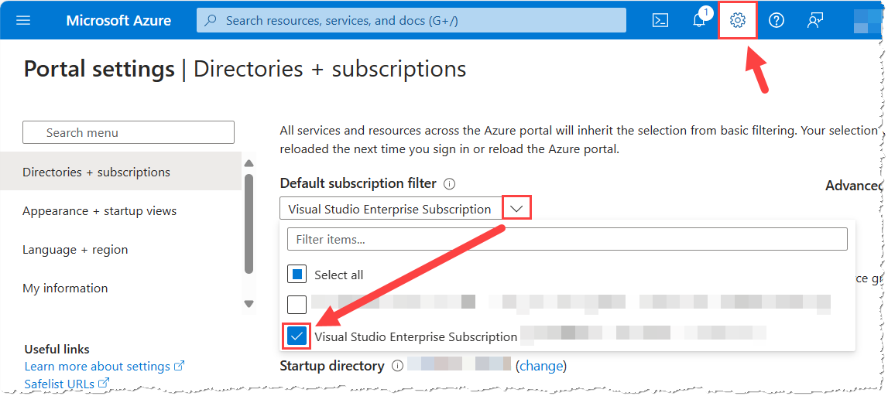
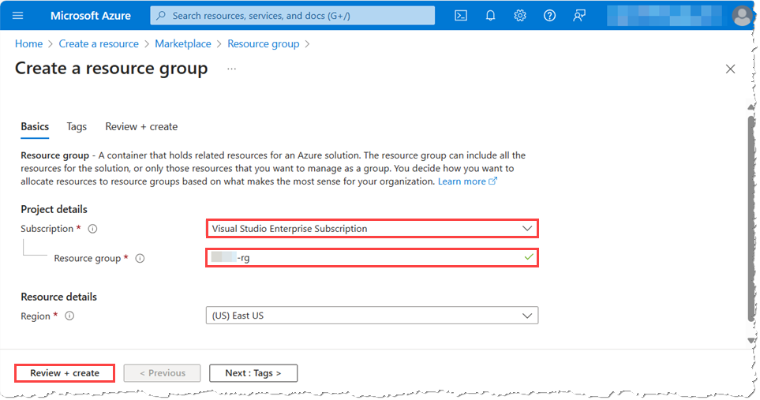
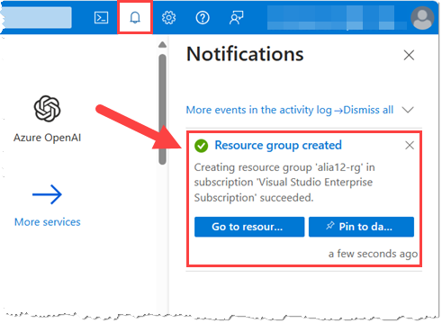
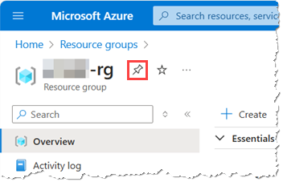
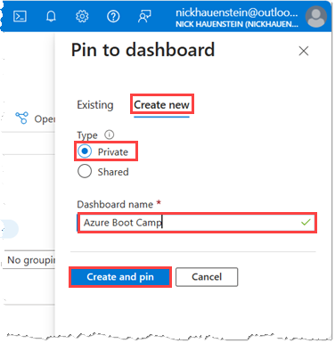
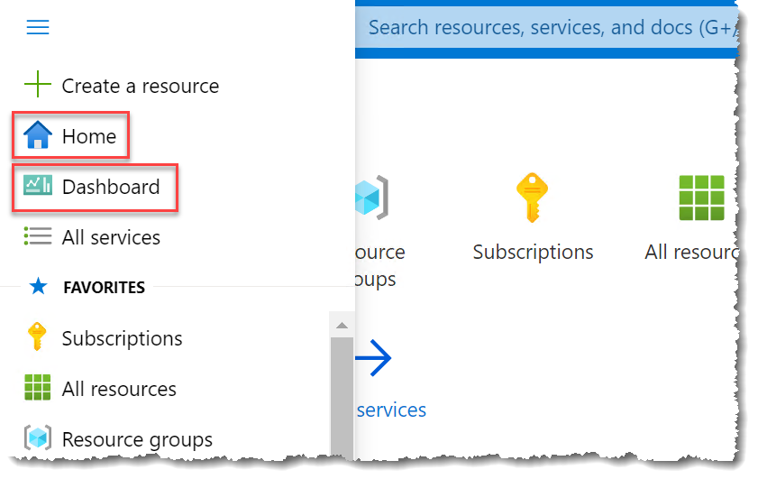

# Exercise 1: Creating a new resource group

In this exercise you will search for your subscriptions, apply a global subscription filter and then create a resource group.

__Your Subscription__: As a full-time Microsoft employee, you have a _learning & growth_ benefit in the form of a **Visual Studio Enterprise Subscription** (formerly MSDN subscription). This subscription provides access to virtually all Microsoft software for dev and test; priority support, world-class training, partner offers, and credits and discounted rates for development and testing in Azure. For this Azure Engineering Boot Camp event, you will use the monthly Azure credits offered as part of your __Visual Studio Enterprise Subscription__.

> **NOTE:** You must have already activated your FTE benefit subscription using the steps found at https://aka.ms/bootcamp/getready to continue with the Azure Boot Camp Labs. If you have not yet completed this step, please do so __now__. If you are not a Microsoft FTE, seek the guidance of your instructor(s) with regards to which subscription to use.

## Task 1: Verify subscription access

In this task, you will verify that you can access your subscription. You will also note both the **Subscription name** and **Subscription ID**.

1. From a browser, navigate to <https://aka.ms/publicportal>, and authenticate with your __personal account__.

	> __NOTE:__ If you are using __Microsoft Edge__, you will need to ensure that you are using a [browser profile](https://support.microsoft.com/en-us/topic/sign-in-and-create-multiple-profiles-in-microsoft-edge-df94e622-2061-49ae-ad1d-6f0e43ce6435) associated with your personal account. Do NOT authenticate using your __@microsoft.com__ account, unless you have been directed otherwise by an instructor.

1. Enter `Subscriptions` in the search box at the top of the Azure Portal. In the results list that appears as you type, under **Services**, select **Subscriptions**

	

1. On the **Subscriptions** page, you will see a listing of all subscriptions that you have access to. This should include your **Visual Studio Enterprise Subscription**. 

	

	> **NOTE:** If you do not see `Visual Studio Enterprise Subscription` in the list, please ensure that (1) you are logged in using your **personal** account to both the Edge browser, and the Azure Portal website, (2) that your subscription is not filtered out of view using the filters at the top of the subscription listing, (3) that you have activated the benefit by following the instructions at https://aka.ms/bootcamp/getReady, and (4) that you are viewing the correct **directory**, which [can be selected here](https://portal.azure.com/?feature.customportal=false#settings/directory).

1. Note the following columns shown for the subscriptions: _Subscription name_, _Subscription ID_, __My role_.

	> **NOTE:** You may need to adjust the column sizes so that you can view the full **Subscription name** and **Subscription ID**.

1. To ensure that your subscription is allowed to immediately create all resources used in the Azure Engineering Boot Camp lab activities, please **provide your Subscription ID [using this form](https://aka.ms/bootcamp/fundamentals/SubListForm)**.

## Task 2: Set a global subscription filter (optional)

In this task you will set up a global subscription filter. ***Skip this task** if you only have access to a single Azure subscription, or a very small number of Azure subscriptions.*

__Global Subscription Filter:__  Azure users may have access to many subscriptions. In the process of creating resources in Azure, you must select the subscription that will be billed for the resource. Scrolling through a long list of subscriptions to pick one can be tedious. The Azure Portal provides the capability to set a global subscription filter, so that you do not have to scroll through subscriptions you will not be using.

1. In the Azure Portal, from the toolbar at the top of the page, select the **Settings** button.

	

1. On the **Portal settings** page, select __Directories + subscriptions__, if it is not already selected.

1. If you have access to more than one subscription, a drop-down appears under _Default subscription filter_.

	- Under **Default subscription filter**, select the drop-down list, clear the checkboxes next to all of the subscriptions, and then **select the subscription that you plan to use to complete the Azure Engineering Boot Camp lab activities**.

	- Select the **Settings** button again to save the changes, and close the **Portal settings** page.

		

## Task 3: Create a Resource Group

In this task, you will create a resource group to contain the resources that you will create during the lab activities for the Azure Engineering Boot Camp.

__Resource Groups:__  Resource Groups are collections of resources that you define. They partition your entire set of resources into manageable chunks. Every Azure resource must belong to exactly one resource group. All resources in a resource group usually share the same lifecycle. For example, you will use a resource group for all of the resources that you will create in the lab activities this week. At the end of the course, you will delete the resource group and thus all the resources that you created.

1.  In the **Azure Portal**, select the **Show portal menu** button in the top-left corner, and then select __+ Create a resource__

    

1. In the Search box that appears within the __New__ window, enter __Resource Group__ and then select Resource Group

	

1. In the __Resource Group__ window, select __Create__
  
    

1. In the __Create a resource group__ window, make the following choices:

	- Ensure that the __Subscription__ dropdown has your VS FTE subscription selected (__Visual Studio Enterprise Subscription__).

		>__Note:__ If the correct subscription is not automatically selected, go back to the previous task and repeat it to ensure that your Global Subscription filter set correctly.

	- Enter __\<alias\>-rg__ for the __Resource group__  (Replace \<alias\> with __your__ *special alias*, e.g., __\<alias\>-rg__ could be __john23-rg__ as mentioned in the note at the start of this lab).

	- Set the Region to __(US) East US__

		> **NOTE:** The region chosen here is not important. The resources contained inside the resource group can be created in any region. You will be creating resources across multiple regions in the labs today. The region selection for the resource group becomes the **default** region for any new resources created inside, but the default can be overridden for each resource created. 

	- Select __Review + Create__

		

1. In the __Review + Create__ tab, review the details to ensure that you have the right subscription, your resource group is named right (\<alias\>-rg), and you have the right location. Once verified, click on __Create__.

	

1. **Wait** for the resource group to be created.

1. In the toolbar, select the **Notifications** button, and then read the Notification about your __Resource group__.

	

## Task 4: View and pin your resource group

In this task, you will review the resource group that you created, and then you will _pin_ your resource group to a new dashboard within the Azure Portal.

1. In the Azure Portal, in the **Search** box at the top of the screen, search for and then select `Resource groups`.

1. **Select** the resource group you just created from the list.

1. **Select** the **pin icon** next to the name of your resource group on the **Overview** page.

	

1. In the **Pin to dashboard** blade that appears on the right, select the **Create New** tab, and then fill out the form using the values below, and then select **Create and pin**.

	- Type: **Private**
	- Dashboard Name: **Azure Boot Camp**

		

1. To find this Resource Group in future, you can now **select** the **Dashboard** icon from the left of the Azure Portal home screen. Alternatively, you can also find your most recently deployed resources by selecting the **Home** icon and scrolling to the bottom of the page.

	

## Summary

In this short exercise, you launched the Azure portal, reviewed your subscription details, created a new resource group, and pinned the resource group to a dashboard for easy access during future activities.
