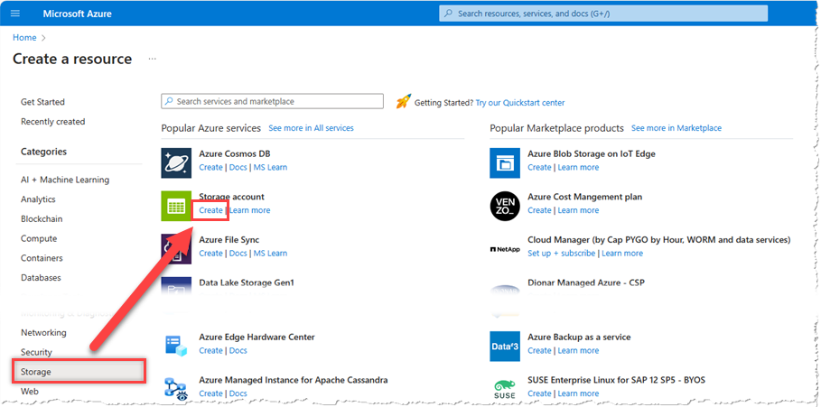
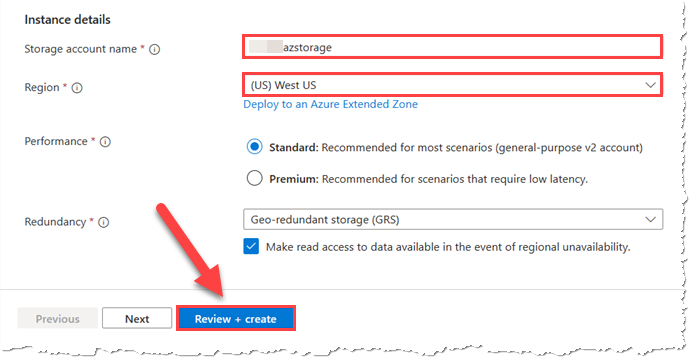
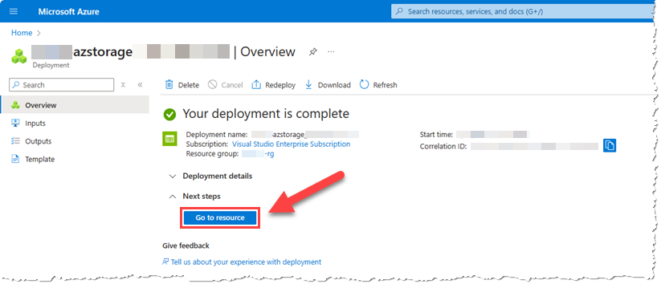
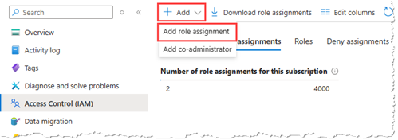
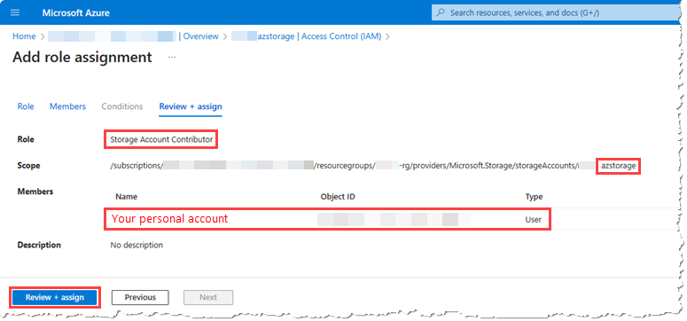
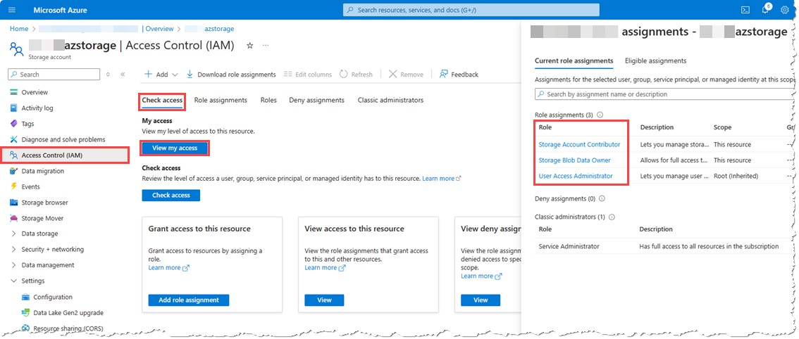
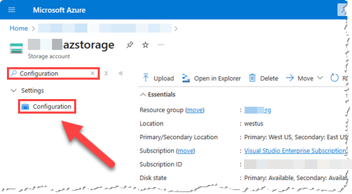
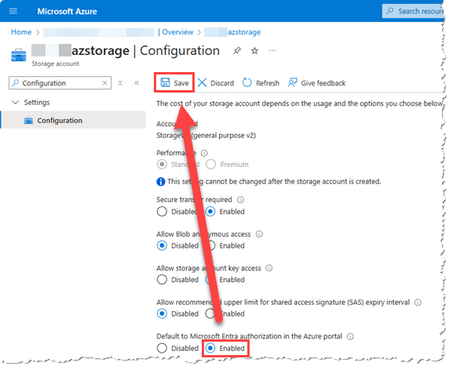

# Create a storage account

## Overview

In this exercise, you will create this storage account.

## Task 1: Create the storage account

In this task, you will create a new storage account.

1. Select __Create a resource__ > __Storage__ > __Create__ > __Storage Account__ (Enter Storage Account into the Marketplace search)
	
	

1. On the **Basics** Tab, in the **Project Details** section,  enter your subscription and resource group information

    - Subscription: __Visual Studio Enterprise Subscription__

    - Resource group: __\<alias\>-rg__

1. In the __Instance details__ section, specify the following configuration values and accept all other default values:

	- Storage account name: __\<alias\>azstorage__
	- Region: __(US) West US__

	

1. Notice the options in the redundancy drop down. Take a minute to relfect on the cloud redundacy patterns that were discussed in the session.

1. Select **Review + create**, and then select **Create**

 **NOTE:** It will take approximately 1 min for the storage account to be created.

1. Once the storage account is created, select **Go to resource** and navigate to the storage account resource that you just created

	

## Task 2: Configure permissions for your storage account

In this task, you will configure permissions for the new storage account. Initially you will set yourself as  **Contributor** (full read/write access) to the storage account itself, 
and also as **Owner** (full read/write access + ability to manage permissions) of the **data** inside the **Blob storage service** within the account. 
These permissions will allow you to complete the tasks that follow regardless of *where* they're done -- inside or outside of the Azure portal.

Inside the Azure portal you are able to complete all subsequent tasks whether you use Entra ID authentication or storage account keys for authentication and authorization. 
In real life, however, [you want to strictly use **Microsoft Entra ID for authentication** and Azure Role-based Access Control (RBAC) for
 authorization](https://learn.microsoft.com/en-us/azure/storage/blobs/authorize-data-operations-portal#use-your-microsoft-entra-account). 
 During storage account creation you can enable this as a default authentication method within the Azure portal on the **Advanced** tab.

1. From the Storage account overview tab, select **Access Control (IAM)**.

1. From the **Access Control (IAM)** page, select **Role assignments**.

	 page")

1. On the **Role assignments** tab, select **Add** > **Add role assignment**.

	

	> **NOTE:** Typically Azure Role-based Access Control (RBAC) deals with permissions for **control plane** operations 
	(e.g., the `Create`, `Read`, `Update`, `Delete` of a given type of resource like a storage account), however some types of resources use the same model for controlling
	 **data plane** operations (e.g., the `Create`, `Read`, `Update`, `Delete` of **data within** a resource like a blob, file, queue message, etc.). 
	 Azure Storage is one such service that allows you to use Azure RBAC role assignments to grant permissions to the data that it manages. In this task you are assigning your identity to a 
	**control plane** focused role of `Storage Account Contributor` that allows you to manage settings of the storage account itself 
	and perform any operation other than changing permissions, and a **data plane**-focused role of `Storage Blob Data Owner` which allows you to fully manage Blob storage data **within** the storage account.

1. In the **Add role assignment** blade, on the **Role** tab, search for and then select the following **Job function role**: **Storage Account Contributor**

1. On the **Members** tab, select the **Select members** button, search for and then select **your personal account**

1. On the **Review + assign** tab, ensure that the following is displayed, and then select **Review + assign**:
	- Role: **Storage Account Contributor**
	- Scope: Resource id string ending with \<alias\>azstorage
	- Members: **Your personal account**

		

1. In the same way, **add another role assignment** using the values shown below:
	- Job function roles: **Storage Blob Data Owner**
	- Members: **Your personal account**
	- Condition: **None**

1. From the Storage account **Access Control (IAM)** page, on the **Check access** tab, and select **View my access**

	

	> **NOTE:** If you completed the task successfully you will see the roles of **Storage Account Contributor**, and **Storage Blob Data Owner** listed, 
	plus any others you may or may not have inherited from other scopes (e.g., from the subscription itself). If you'd like to investigate all of the powers you now have
	 as a result of each, you can select the links for each role name, and then search for `Microsoft.Storage` to see the effective permissions you have for Storage account resources specifically.

1. From the **Overview** page of your storage account, search for and then select **Configuration**

	

	> **NOTE:** Now that you have ensured that your account has proper permissions, you need to configure the Azure Portal to default to Entra ID for authentication and Azure RBAC for authorization while interacting with your storage account.

1. On the **Configuration** page, for **Default to Microsoft Entra authorization in the Azure portal**, select **Enabled**, and then select **Save**

	

	> **NOTE:** In the future if you'd rather not search for the menu item, you can directly access the **Configuration** page from the **Overview** page under the **Settings** heading.

## Summary

In this short exercise, you created a storage account and configured data plance access using Azure RBAC.