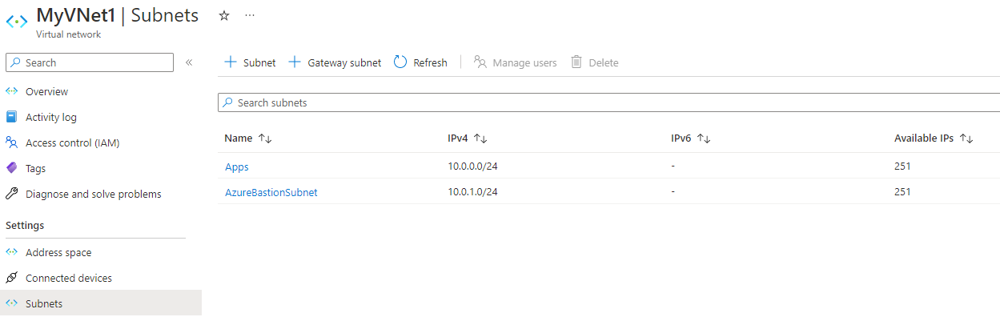

# Lab 1: Set up infrastructure components

> __Note:__
> For today's labs you will be using your FTE personal subscription that you set up before the boot camp. It should be called **Visual Studio Enterprise Subscription**.

Recall from the theory lesson, every resource that is created in Azure, must be associated with a resource group. As a result, you will create a resource group in this task to serve as the logical container for the resources that are created as part of this course.

## Create a virtual network (15 mins)

In this lab, you will create a virtual network and default subnet. You will create and deploy a virtual machine in an upcoming lab, and associate it with the virtual network you create in this task. A virtual network is required for communications between your Azure resources within Azure, as well as external resources such as the internet. Recall that a virtual network allows you to replicate an on-premises IP address scheme, but also allows you to segregate your resources in Azure by using sub-networking.

1. Ensure you are signed in to the Azure portal at <a href="https://portal.azure.com" target="_blank">https://portal.azure.com</a>
1. From the **Home** blade, select **+ Create a resource**
1. In the **Search services and marketplace** text box, enter *Virtual Network* and then select **Virtual Network** from the list presented.
1. On the **Virtual Network** blade, select the **Create** button

> __Note:__
> The Azure portal undergoes constant updates. As a result, screen shots and options may be different in this lab and your portal view. The instructions should still be relevant

5. On the **Basics** tab, fill in the following information (leave the defaults for everything else):

    - **Subscription:** - Your **Visual Studio Enterprise Subscription**
    - **Resource Group:** - Select the **&lt;alias&gt;-rg** resource group that you created previously
    - **Name:** - **myVNet1**
    - **Region:** - **(US) East US**

1. Select the **IP Addresses** tab, or select the **Next: IP Addresses** button at the bottom of the page.
1. In **IPv4 address space**, note the existing address space that Azure has provided.
1. Select the **default**subnet name. The **Edit subnet** pane opens
1. Change the name to **Apps** and select **Save**. This will be the subnet that you will associate the VM with in a later lab. The name **Apps** is sued to indicate that this subnet will hold resources related to an app, in this case, a web server.
1. Select **Review + create**
1. When validation passes, select **Create**

## Create a Bastion Host configuration

In this section, you will create an Azure Bastion Host configuration that will allow you to remotely access the VM in a secure manner.  It is easier to setup the Bastion Host while we are working with the virtual network.

1. Ensure that you are viewing your virtual network **MyVNet1**
1. Under the **Settings** category in the left pane, select **Bastion**
1. Select the **Configure Manually** button
1. On the **Create a Bastion** blade, choose your Azure subscription and resource group, as before
1. In the **Name** text entry, enter **BastionHostWeb**
1. Set the **Region** to **East US**
1. Leave the **Tier** and **Instance Count** at their default settings
1. Under **Virtual Network**, select **MyVNet1** from the drop down list
1. Notice the error message indicating Bastion must be associated with a subnet.
1. Select **Manage subnet configuration**
1. The **Subnets** blade of your virtual network opens
1. Select **+ Subnet**
1. In the **Subnet Purpose** drop down, select **Azure Bastion**.
1. The **Subnet address range** is already populated with the IP address of **10.0.1.0/24** We don't need to change that so select the **Save** button to add the new subnet
1. After a few seconds, your new subnet should be displayed
1. Click on the breadcrumbs to navigate back to the **Create a Bastion** blade
1. Ensure your newly created subnet is selected
1. Use the default **Public IP address** configuration 
1. Click **Review and Create** and then click **Create**

16. You are now ready to move on in the class.
