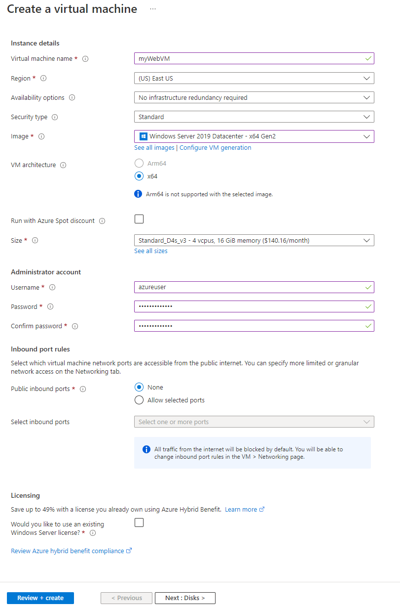
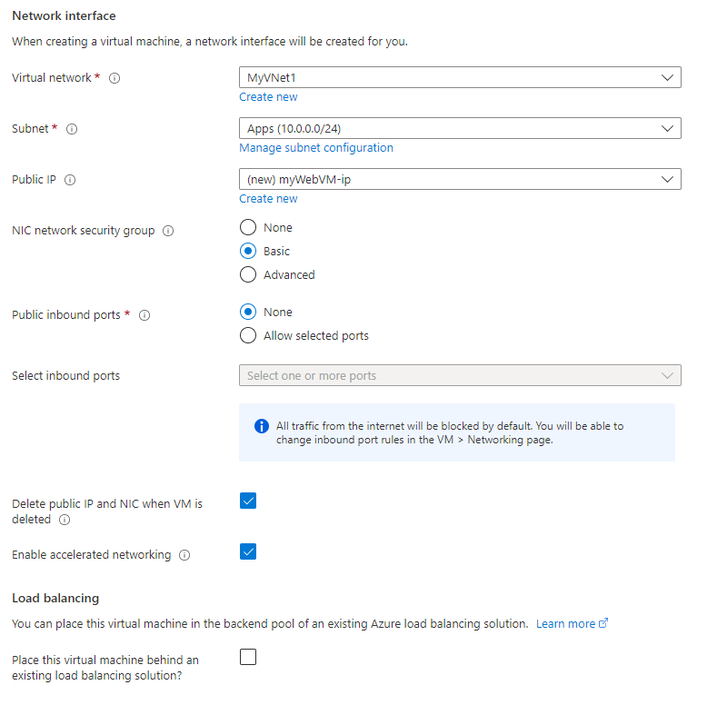
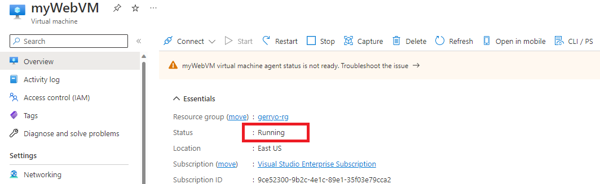
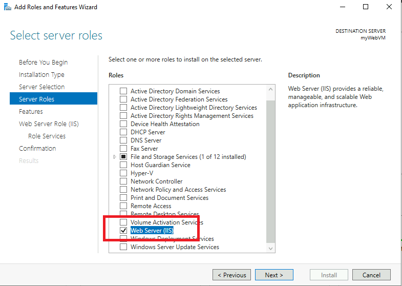
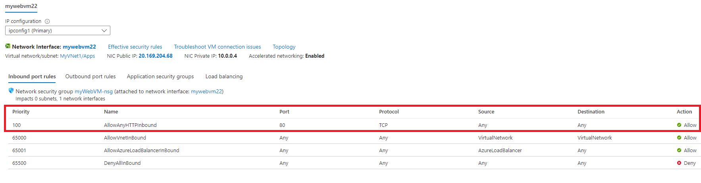

# 01 - Create a virtual machine in the portal (20 mins)

In this lab, you will create a Virtual Machine in the Azure Portal and verify its successful creation. The scenario for this lab is intended to emulate the provisioning of a Windows Server VM on Azure, in the Infrastructure as a Service (IaaS) model. In this scenario, you represent an IT administrator who has been tasked with creating a virtual machine on Azure, that may eventually host the Internet Information Services (IIS) role. This is being stage for the future migration of the web hosting functions from an on-premises location, to Azure.

In the preceding lab, you began the infrastructure set up by creating a virtual network. The virtual network was a required first step to ensure that you new VM will be able to communicate with other Azure resources and the internet. In a later lab, you will enable and use the Azure Bastion host feature in Azure to remotely login to this Windows Server VM so that you can administer the server without exposing the remote desktop port.  Exposing ports on your Azure resources creates potential attack vectors that may be exploited. You will learn more about the Azure Bastion host in a later module and understand how it helps to alleviate some security issues surrounding remote access to Windows VMs on Azure.

> __Note:__
> For today's labs you will be using your Visual Studio Enterprise Subscription as part of the FTE benefit

> __Note:__
> As you progress through the labs, frequently you will see instructions indicating "**+ Add, + Create, + New**". Be aware that various places in the Azure portal use **Add** *or* **Create** *or* **New** when you are creating / deploying a new resource. For convenience,  lab steps mention all three though you will most often find only one of them in the portal for any given step.

## Task 1: Create the virtual machine 

1. Sign in to the Azure portal: **https://portal.azure.com**

2. In the **Search services and marketplace** text entry field, search for and select **Virtual machines**, and then click **+Add, +Create, +New** and choose **Azure virtual machine** from the drop down.

> __Note:__
> You will also typically find the **Virtual Machine** resource on the list of Popular Azure services found on the **Create a resource** pane.

3. On the **Basics** tab, fill in the following information (leave the defaults for everything else):

    - **Subscription:** - **Visual Studio Enterprise Subscription**
    - **Resource group:** - Use the resource group you created in the previous lab
    - **Virtual machine name:**  - **myWebVM**
    - **Region:** - **(US) East US**
    - **Availability options:**  - No infrastructure redundancy required
    - **Security type** - Leave set to Standard
    - **Image:**  - **Windows Server 2019 Datacenter - x64 Gen2**
    - **Size:**  - Leave the default size
    - **Administrator account username:** - **azureuser** 
    - **Administrator account password (type in carefully!):**  - **Demo@Pass1234**
    - **Public inbound ports:**  - Select the **None** radio button. We do not want to expose the remote desktop protocol (RDP) port.

4. Switch to the Networking tab to ensure **MyVNet1** is selected in **Virtual network** option.
1. Ensure that the **Subnet** option shows the *Apps* subnet entry.
1. Ensure that **Basic** is selected for the NIC network security group.
1. Select the option **Delete public IP and NIC when VM is deleted**.
1. Leave the remaining options at their default settings.

9. Switch to the **Management** tab.
1. In the **Auto-shutdown** section, select the **Enable auto-shutdown** check box, choose your local **Time zone**  and deselect the **Notification before shutdown** box.

1. Switch to the **Monitoring** tab and ensure that **Boot diagnostics:**  is set to **Disable**.

1. Leave the remaining values on the defaults and then click the **Review + create** button at the bottom of the page.

1. Once validation has passed click the **Create** button. It will take several minutes to deploy the virtual machine.

1. You will receive updates on the deployment page and via the **Notifications** area (the bell icon in the top menu bar).

## Task 2: Confirm successful deployment of the Virtual Machine

In this task, you will confirm that our new Virtual Machine was successfully deployed.

1. Click on the bell icon from the upper blue toolbar, and select 'Go to resource' when your deployment has succeeded.

    > __Note:__  You can also use the **Go to resource** link on the deployment page when deployment is complete

2. On the virtual machine **Overview** blade, confirm that the status indicates **Running**.

## Task 3: Connect to the virtual machine remotely

> __Note:__ This section of the lab will only function if you are using your personal FTE provided Azure subscription. As a part of the zero-trust policy at Microsoft, incoming connection requests, even on port 443, are not permitted for non-production subscriptions. As a result, this section will not work with the Microsoft Corporate subscriptions.

You will now connect to the virtual machine in a secure manner. In this instance, you will use the Azure Bastion host that you configured in the virtual machine lab. Recall that when you configured this virtual machine, you chose to not enable the remote desktop protocol. This ensures that the RDP port is not exposed to the internet. The procedure you will use here, relies on the Azure Bastion host and *https* for secure web traffic. In other words, you will access the VM using just a web browser. There is no requirement for the remote desktop client software to be installed on your computer.

1. While still on your VM page in the Azure portal, locate and select **Bastion** under **Connect** in the left nav pane.
1. If you successfully created Bastion in the networking lab, it should show up in the **Bastion Host** property.
1. If you don't see your Bastion, select **Deploy Bastion**. It will take a few minutes for Bastion to be deployed
1. Enter your user name and password that you configured for this VM and select **Connect** (you may need to allow popups for the Azure Portal)
1. After a short pause, another browser tab should open and a remote session into your VM should start
1. Once you are logged into the VM, the Server Manager app should automatically load in Windows Server 2019.
1. We want to configure this server as a web server so we need to add the IIS components
1. Under the **Configure this local server** heading, select **Add roles and features**
1. Select **Next** on the initial wizard screen
1. Leave the default *Role-based or feature-based installation* selection and select **Next**
1. Select **Next** on the **Server Selection** page
1. On the **Server Roles** page, select the option for **Web Server (IIS)** and select **Add Features** on the pop-up window

1. Ensure the check box is selected for the **Web Server** role and select **Next**
1. Leave the default selections on the **Features** page and select **Next**
1. Read the text on the **Web Server Role (IIS)** page to understand wha this feature enables, then select **Next**
1. Leave the defaults on the **Role Services** page and select **Next**
1. On the **Confirmation** page, select **Install**
1. It will take a few minutes for the feature to be installed. You can monitor the progress on the **Results** page
1. When the progress indicates the installation succeeded, you can select **Close** to close the wizard
1. Select the **Internet Explorer** icon on the taskbar to open the web browser. Accept the defaults in the pop-up dialog
1. In the browser address bar, type **http://localhost** and press **Enter**. You should see an Internet Information Services page displayed which indicates your web server is running.

## Task 4: Allow inbound web traffic

Before your web server can be accessed from the internet, you need to add an inbound security rule. You will do this now. These rules will be explained in a later module when we discuss security but for now, you will complete this step to test your web server from the internet.

1. Go back to the **Overview** tab for your VM
1. Locate and select the **Network settings**  option under **Networking** in the left nav pane
1. Click on the **Create port rule** button and select **Inbound port rule**
1. In the panel that opens, change the **Service** drop down option to **HTTP**
1. Leave the remaining options at their default and select **Add**
1. After a short time, you should receive a notice tha the rule was added and you should now see it in the list with a **Priority** of 100

1. Go back to the **Overview** page for your VM
1. Locate the **Public IP address** and copy it to the clipboard
1. Open a new browser tab, paste the IP address into the browser, and press **Enter**. The Internet Information Services page should load
1. **Congratulations!** You have created a new web server VM running in Azure.

> __Note:__ Take note of all the steps you performed in this lab. This demonstrates most of the responsibility of a customer setting up a web application hosting scenario, on Azure, using the Infrastructure as a Service (IaaS) model. There are a lot of steps to create and configure a virtual network, choose and install an appropriate virtual machine with an operating system, configure the server for the web server role, and create an inbound security rule so it can be accessed. The remaining responsibilities of the customer will be to install the web application files, patch the operating system, manage any scaling options and availability options, if required.
