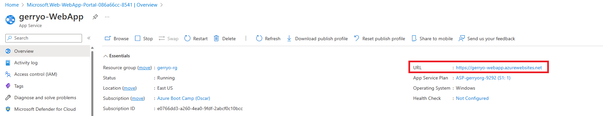

# 01 - Create a web app in the Azure portal (10 mins)

In this lab, you will provision a simple web app in the Azure portal. While the steps you take within this lab will setup a simple web app hosted on Azure, they are designed to show the differences between hosting a web app in the IaaS model vs the PaaS model, which will be demonstrated in this lab.

> __Note:__
> Take time during this lab to click and read the informational icons.

> __Note:__
> As you progress through the labs, frequently you will see instructions indicating "**+ Add, + Create, + New**". Be aware that various places in the Azure portal use **Add** *or* **Create** *or* **New** when you are creating / deploying a new resource. For convenience,  lab steps mention all three though you will most often find only one of them in the portal for any given step.

## Task 1: Create a web app using the Azure portal 

1. Sign in to the Azure portal: **https://portal.azure.com**

1. From the **Home** page in the portal, select **+ Create a resource**.

1. In the **Search services and marketplace** text field, enter **Web App**, and press Enter.

1. Find the Web App entry in the displayed services and select **Create**, then **Web App**.

> __Note:__
> You will also typically find the **Web App** resource on the list of Popular Azure services found on the **Create a resource** pane.

3. On the **Basics** tab, fill in the following information (leave the defaults for everything else):

    - **Subscription:** - **Visual Studio Enterprise Subscription** per instructions above
    - **Resource group:** - Use the resource group you created in the previous lab
    - ***Name** - Use the name **<alias>-WebApp** (Ensure you replace <alias> with your own alias)
    - **Publish** - Ensure that the **Code** option is selected
    - **Runtime stack** - From the drop-down, select **ASP.NET V4.8**. You will note that the **Operating System** option automatically selects Windows.  If you chose **.NET 6 (LTS)** or many of the other options, you could use Linux as the base OS but we will use ASP.NET for this exercise.
    - **Pricing Plans** - leave the defaults for both options under this section.
    - Select **Next: Deployment** at the bottom of the page. Many times an organization will use GitHub for the repository for the files that make up the web app. This is a great option for continuous deployment scenarios. We are not adding any additional files at this time so we can leave the defaults on this page.
    - Select **Next" Networking** at the bottom of the page. Recall that in the IaaS lab, you had to configure a virtual network and then add your VM and other components to that virtual network. In the PaaS model, you don't need to worry about configuring a virtual network.  Instead, as you can see from this page, you simply ensure that **Enable public access** is turned on, to allow inbound traffic to the web server.
    - Select **Review + Create** and then select **Create** to begin the process of creating your web app.
    - After a few minutes, your web app should be deployed and you can select **Go to resource** to see the status.

## Task 2: Confirm successful deployment of the web app

In this task, you will confirm that our new web app was successfully deployed.

1. On the Overview page for your web app, locate the **URL** for the web site inn the upper right section.

2. Right-click the URL and select to open in a tab.

1. Your web app should display a static web page in the browser window

3. **Congratulations!** You have successfully created and deployed a static web app in Azure.

> __Note__
> While this lab may seem less compelling than the previous one, it's important to note a few things.
> - You have a working web application that is being hosted on Windows Server using the IIS role
> - You did not have to configure any infrastructure components such as networking
> - You did not have to create, deploy, and configure a virtual machine
> - You did not have to create a network security group or firewall rules
> - You did not have to add the Azure Bastion host for remote access.  
> - As a matter of fact, you do not have remote access to the VM that is running this service for you. You are simply responsible only for the code and web pages that make up your web app
