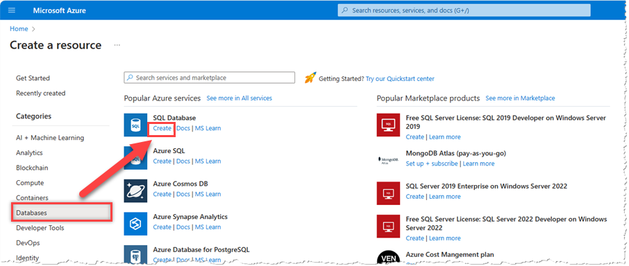
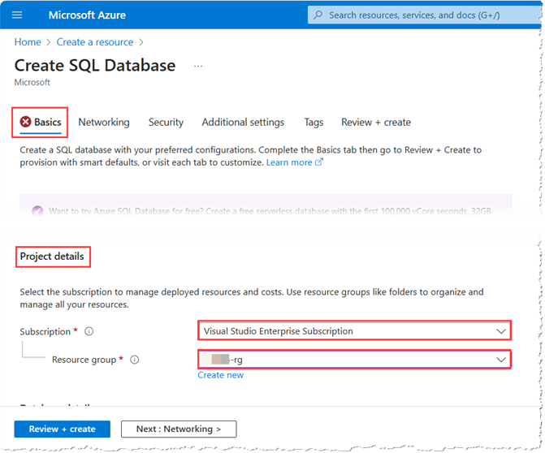
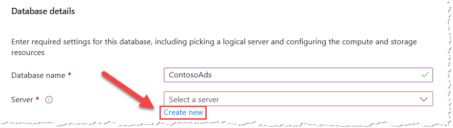
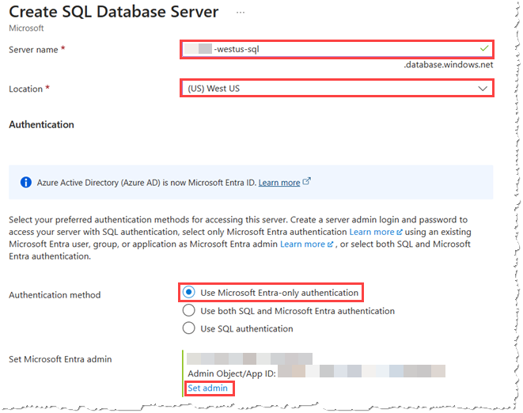
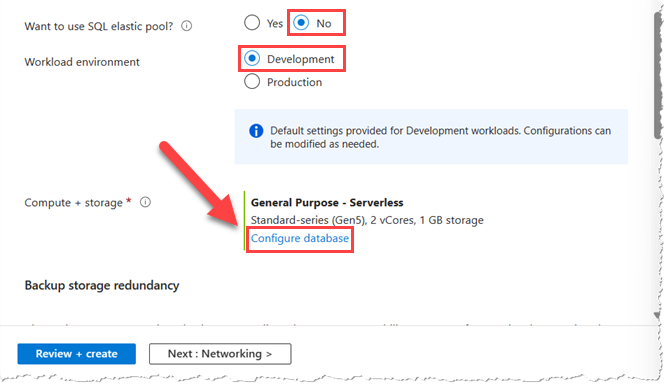
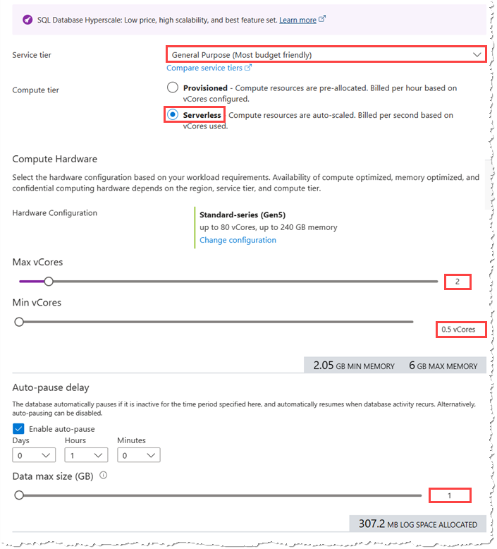
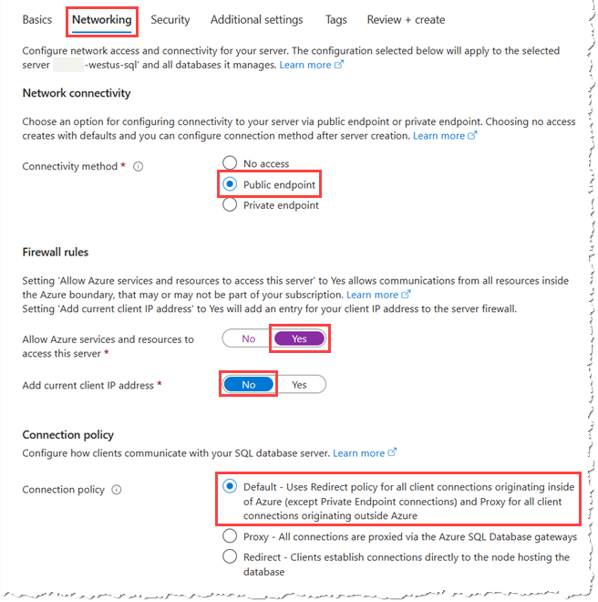
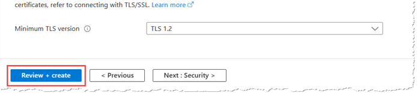

# Create Azure SQL databases

## Overview

 In this exercise, you will start the process by creating a database.

## Create the Azure SQL database

1. Navigate to the **[Azure Portal](https://aka.ms/publicportal)**, and authenticate using your **personal credentials**

1. Select __Create a resource__ \> __Databases__ \> __SQL Database__\> __Create__

    

1. On the **Basics** Tab, in the **Project Details** section, enter your subscription and resource group information

    - Subscription: __Visual Studio Enterprise Subscription__

    - Resource group: __\<alias\>-rg__

		

1. Continue in the **Basics** Tab, enter your information under **Database details**

     - Database name: **ContosoAds**

     - Server: Select **Create new**

        

    1. In the server configuration blade, specify the following configuration (replace \<alias\> with your own username/alias):  

        - Server name: __\<alias\>-westus-sql__

        - Location: __(US) West US__ *(You may have to scroll all the way to the bottom of the region list to be able to select this region)*

        - Authentication method: _Use Microsoft Entra-only authentication_

        - Set Microsoft Entra admin: Select **Set admin**, and then in the **Microsoft Entra ID** blade, search for and then select **your personal account**

            

1. **Close** the **Create SQL Database Server** blade by selecting __OK__

1. In the __Create SQL Database__ blade, specify the following configuration values:

    - Want to use SQL elastic pool?: __No__

    - Workload environment: __Development__

    - Compute + storage: __Select Configure database__

    

1. In the **Configure** blade, specify the following options:
    - Service tier: **General Purpose (Most budget friendly)**
    - Compute tier: **Serverless**
    - Max vCores: **2**
    - Min vCores: **0.5 vCores**
    - Auto-pause delay: **Enabled**, **1 Hours**
    - Data max size (GB): **1**

        

        > **NOTE:** These options provide the **least possible cost**. To achieve low cost, you are accepting a reduced maximum storage size and reduced overall performance. However, the Max vCores *is above the minimum floor* to which it *could* be set, so that the performance provided isn't too painful.

1. If you haven't already done so, in the **Configure** blade, select **Apply** to return to the **Create SQL Database** blade

1. Continue to the **Networking** tab and specify the following configuration values:

     - Connectivity method: **Public endpoint**
     - Firewall rules - Allow Azure services and resources to access this server: **Yes**
     - Firewall rules - Add current client IP address: **No**
     - Connection policy: **Default**

        

        > **NOTE:** While Contoso is choosing **public endpoint** here for simplicity. A more secure and better choice for real-life work in Azure is to use [Private endpoint](https://learn.microsoft.com/en-us/azure/azure-sql/database/private-endpoint-overview?view=azuresql).

1. Complete the deployment by selecting __Review + create__ 

    

1. Select __Create__ to create your database server and database. Deployment will take between 2-5 minutes, but you can proceed to the next exercise while it is deploying in the background

## Summary

In this exercise, you created a database server in the West US region and a database named ContosoAds on that server.