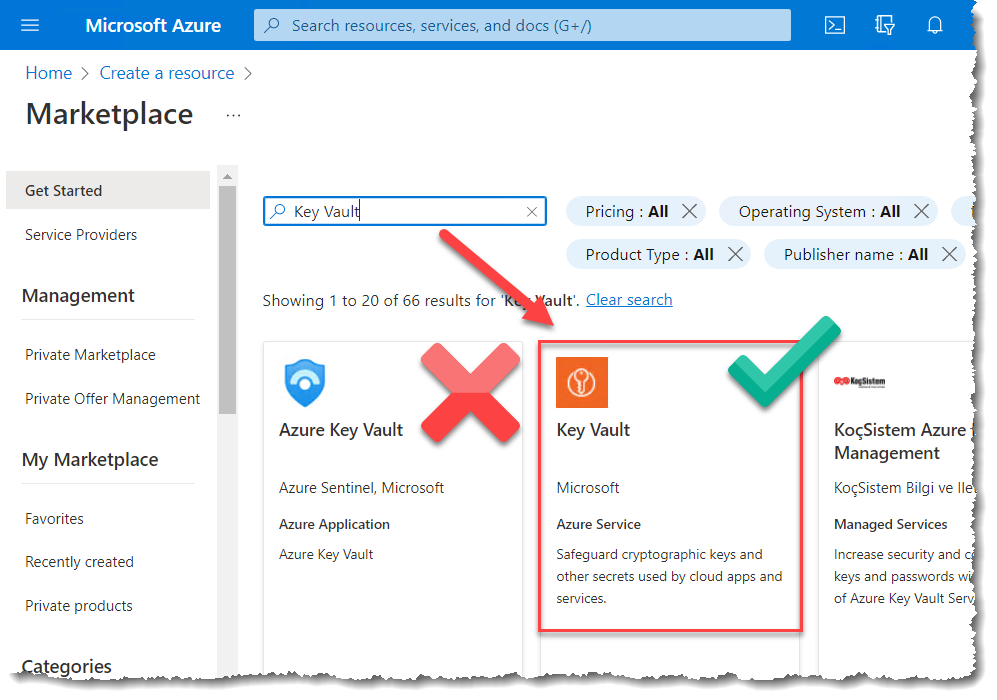
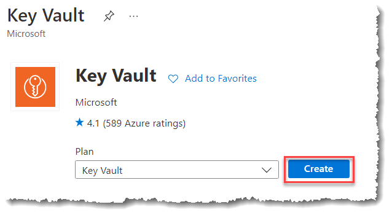
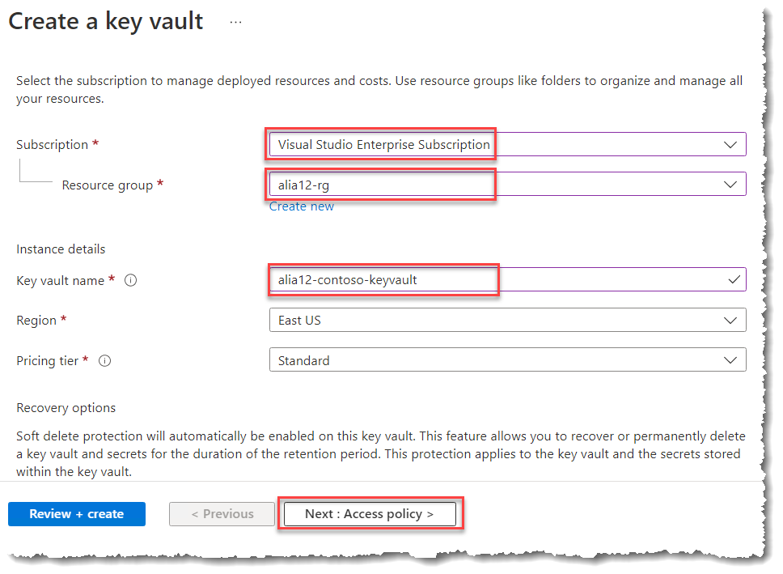
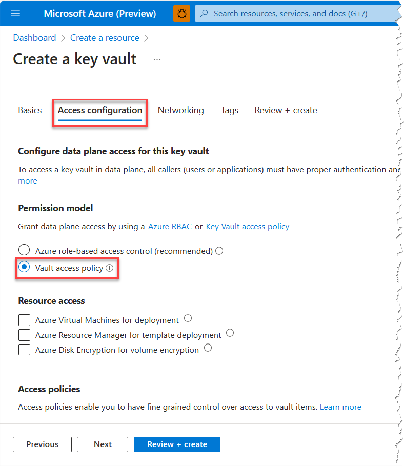
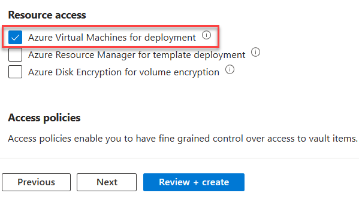

# Exercise 1: Creating an Azure Key Vault Resource

In this exercise you will create a new Azure Key Vault resource to act as a central secure repository for secrets.

Key Vault is a public service and this task uses the publicly available capabilities. Full details on these capabilities in KeyVault are available at <https://aka.ms/kvdocs>

## Task 1: Launch the Azure Management Portal

1. From your browser, navigate to <https://portal.azure.com>
    and authenticate with your __Personal Credentials__.

## Task 2: Create new Key Vault resource

1. In the Azure portal, select __Create a resource__.

1. Search for and then create a __Key Vault__ resource.

   > **NOTE:** There is a similarly named **Azure Key Vault** item in the marketplace which is actually a solution for Microsoft Sentinel to stream Key Vault diagnostic logs into Microsoft Sentinel. As a result, please ensure that you are selecting **Key Vault** and *NOT* **Azure Key Vault**.

   

1. In the **Plan** list, keep the default selection of **Key Vault**, and then select **Create**.

   

1. On the Create key vault blade, specify the following information (replace \<alias\> with the alias you have been using throughout the lab activities):
   - Subscription: __Visual Studio Enterprise Subscription__
   - Resource Group:  __\<alias\>-rg__
   - Key vault name: __\<alias\>-keyvault__
   - Region:  __East US__
   - Pricing tier: *Leave this as __Standard__*

      

1. Select __Next: Access policy__.

1. On the **Access policies** tab, under **Permission model**, select **Vault access policy**.

   

1. Select __Enable access to Azure Virtual Machines for deployment__. This option allows virtual machines to access the vault for secrets during deployment (e.g., when creating Service Fabric clusters).

   

1. Also on the Access policies tab, you will notice that your account has already been added to the access policy with full permissions.

1. Select __Review + create__, and then in the Create a key vault blade, select __Create__ leaving all other configuration options untouched.

1. You can now __minimize__ your browser window as Key Vault will start deploying.

## Summary

In this exercise you created a new Azure Key Vault resource to store secrets in a centralized and secure way.  You created an access policy that provided access to yourself as well as access for Azure Virtual Machines during deployment.
