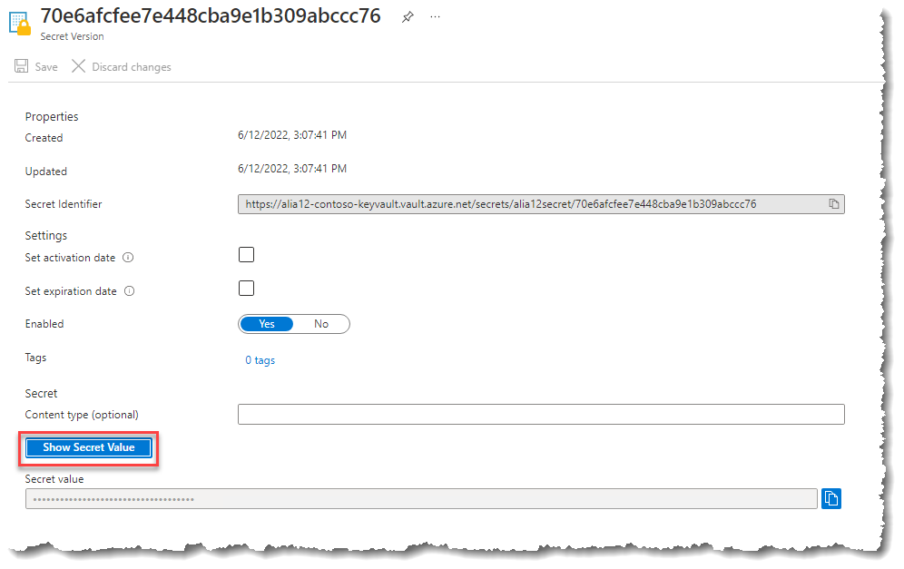
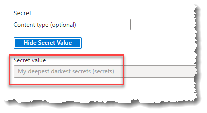

# Exercise 2: Storing Secrets (string values) in Key Vault

In this exercise you will store and retrieve a simple password string in Azure Key Vault. There are a range of options for accessing key vault including PowerShell, a REST API and wrappers for .NET and node.js.

Key Vault is a public service and this task uses the publicly available capabilities. Full details on these capabilities in KeyVault are available at <https://aka.ms/kvdocs>

## Task 1: Launch the Azure Management Portal

1. From your browser, navigate to <https://portal.azure.com>
    and authenticate with your __Personal Credentials__.

## Task 2: Create and Store your secret

To add a secret to the vault, follow the steps:

1. Navigate to your new key vault in the Azure portal
1. On the Key Vault settings pages, select **Secrets**.
1. From the Toolbar, select **Generate/Import**.
1. On the **Create a secret** screen, choose the following values:
    - **Upload options**: Manual.
    - **Name**: \<Alias\>secret
    - **Value**: Type any value at all for the secret. This value will be stored encrypted in the cloud. Key Vault APIs accept and return secret values as strings.
    - Leave the other values with the default settings, and then select **Create**.

1. Once that you receive the message that the secret has been successfully created, **select** it from the list.

## Task 3: Retrieve a secret from Key Vault

1. Select the current version of the secret to see the details about the current secret version.

    > **NOTE:** For more information about secrets attributes, see [About Azure Key Vault secrets](https://docs.microsoft.com/en-us/azure/key-vault/secrets/about-secrets)

1. Select **Show Secret Value** to reveal the hidden secret value.

    

    

    > **NOTE:** You can also use __CLI__, or __PowerShell__ to retrieve previously created secret.

## Summary

In this exercise, you created and stored a secret in the vault. You also retrieved secrets from the vault.
